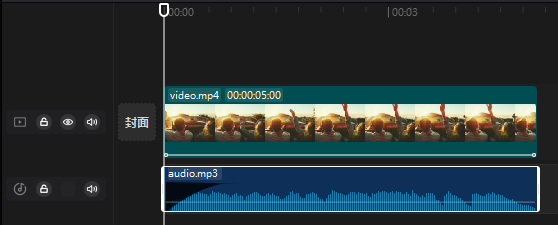

# pyJianYingDraft
### 轻量、灵活、易上手的Python剪映草稿生成及导出工具，构建全自动视频剪辑/混剪流水线！

> ℹ 欢迎为本项目补充6+版本草稿文件的解密方式

> 🧪 本项目仍在快速更新中，欢迎⭐️此项目保持关注！

> 📢 欢迎加入[Discord服务器](https://discord.gg/WfHgGQvhyW)进行用法或新功能的讨论

## 使用思路


# 功能清单
> ℹ 如未额外注明，一般仅在5.9版本上测试过

> 标注☑️的特性**已实现**，标注⬜的特性**待实现**

### 模板模式
> ⚠️ 剪映6+版本对`draft_content.json`文件进行了加密，故**本系列功能目前仅支持剪映5.9及以下版本**

- ☑️ [加载](#加载模板)（未加密的）`draft_content.json`文件作为模板
- ☑️ [替换音视频片段的素材](#根据名称替换素材)
- ☑️ [修改文本片段的文本内容](#替换文本片段的内容)
- ⬜ 将模板草稿中的轨道整体导入到另一草稿中
- ☑️ [提取模板中出现的贴纸/气泡/花字等元信息](#提取素材元数据)

### 批量导出
> ⚠️ 剪映7+版本隐藏了控件，故**本系列功能目前仅支持剪映6及以下版本**

- ☑️ 控制剪映打开指定草稿
- ☑️ [导出草稿至指定位置](#批量导出草稿)
- ☑️ 调节导出分辨率和帧率
- 感谢`@litter jump`提供部分思路

### 视频与图片
> ℹ 以下草稿生成功能（音视频、贴纸、文本、特效等）支持剪映5及以上的所有版本

- ☑️ 添加本地视频/图片素材，并[自定义片段的时间、持续时长或播放速度](#素材截取与整体变速)
- ☑️ [视频整体调节](#视频整体调节)（旋转、缩放、亮度等）以及[关键帧生成](#关键帧)
- ☑️ 视频片段的[入场/出场/组合动画](#添加片段动画)
- ☑️ 添加[蒙版](#蒙版)、[片段特效](#添加片段特效)和[滤镜](#添加片段滤镜)
### 贴纸
- ☑️ 根据元信息[添加贴纸](#提取素材元数据)
- ☑️ 贴纸的[关键帧](#关键帧)生成
### 音频
- ☑️ 添加本地音频素材，并[自定义片段的时间、持续时长或播放速度](#素材截取与整体变速)
- ☑️ 调整淡入淡出时长[(示例代码)](demo.py)，调整音量[(示例代码)](demo.py)及其[关键帧](#关键帧)
- ☑️ 添加音频片段的[场景音效果](#添加片段特效)，并设置参数
### 轨道
- ☑️ [添加轨道](#多轨道操作)以及[将片段添加到指定轨道](#多轨道操作)
- ☑️ 自定义视频/滤镜/特效轨道的[层级关系](#多轨道操作)
### 特效、滤镜和转场
- ☑️ 吸附于片段上的[特效](#添加片段特效)、[滤镜](#添加片段滤镜)和[动画](#添加片段动画)
- ☑️ 位于[独立轨道的特效和滤镜](#独立轨道上的特效和滤镜)
- ☑️ 添加转场[(示例代码)](demo.py)，并自定义其时长
### 文本及字幕
- ☑️ [添加文本、设置字体及样式](#添加文本)、修改文本片段的[位置及旋转设置](#视频整体调节)
- ☑️ 文本的[关键帧](#关键帧)以及[动画](#添加片段动画)
- ☑️ 文字描边和文字背景
- ☑️ 文字气泡效果和花字效果[(示例代码)](demo.py)
- ☑️ [导入`.srt`文件](#导入字幕)生成字幕并批量设置格式

# 安装
pyJianYingDraft现已支持pip安装（不含demo），推荐使用开发时测试的Python版本3.8或3.11
```
pip install pyJianYingDraft
```

> ℹ 如遇安装后import失败, 可能与uiautomation的兼容性问题有关，参见[相关issue](https://github.com/GuanYixuan/pyJianYingDraft/issues/12)

# 快速上手
例程`demo.py`将创建包含音视频素材和一行文本的剪映草稿文件，并且添加了音频淡入、视频入场动画、转场效果和文本气泡/花字。

这个例程的操作方法如下：
1. 在剪映里**创建一个空草稿**，找到它对应的**文件夹路径**（类似`.../JianyingPro Drafts/9月5日`）
2. **返回剪映首页**或退出剪映
3. 将代码中`DUMP_PATH`变量的值改为**草稿文件夹下的`draft_content.json`路径**，随后运行`demo.py`
4. 现在在剪映中**重新打开这个草稿**，你应该看到类似如下的时间轴：



你可以仔细检查音频片段的音量设置、淡入效果时长以及视频片段的入场动画效果等，看看是否符合上述代码的设置

# 用法文档

> ℹ 文档部分推荐从[功能清单](#功能清单)一节中选取感兴趣的功能阅读，而非直接按顺序阅读

### 模板模式
为了保留部分复杂特性（文本特效、复合片段...），可以加载一个已有的剪映草稿作为模板，然后**替换其中部分片段的内容**。

目前提供了**三种替换功能**：
- [根据名称替换素材](#根据名称替换素材)：直接替换素材本身，自然影响所有引用该素材的片段
- [根据片段替换素材](#根据片段替换素材)：替换某个特定片段的素材，同时重新选取其引用的素材范围
- [替换文本片段的内容](#替换文本片段的内容)：保留所有文本格式，但替换其内容

除此之外，对于某些没有特定名称的特性（贴纸、花字等），提供了[提取素材元数据](#提取素材元数据)的功能以提取其`resource_id`

> ⚠️ 由于剪映6+版本对草稿文件进行了加密，故**暂不支持加载来自6+版本的草稿文件**作为模板

> ℹ 若出现模板内容丢失的情况，欢迎反馈

#### 加载模板
推荐使用`Draft_folder`来管理剪映的草稿文件夹（可以在剪映的`全局设置`-`草稿位置`中查询），这样能够方便地根据已有模板生成新草稿。

```python
import pyJianYingDraft as draft

draft_folder = draft.Draft_folder("<剪映草稿文件夹>")  # 一般形如 ".../JianyingPro Drafts"
script = draft_folder.duplicate_as_template("模板草稿", "新草稿")  # 复制"模板草稿"，并命名为"新草稿"，同时打开新草稿供编辑

# 对返回的Script_file对象进行编辑，如替换素材、添加轨道、片段等

script.save()  # 保存你的"新草稿"
```

为了最大限度地兼容模板中的复杂特性，**导入的轨道与pyJianYingDraft创建的轨道是分离开的**，具体地讲：

- 除下述替换功能外，不能在导入的轨道上添加片段、转场、淡入淡出、特效等
- **仍然可以创建新的轨道，并在其上添加片段等**，就像非模板模式一样

> ℹ 导入轨道的限制也许会在后续版本中逐渐取消

#### 提取素材元数据
对导入的`Script_file`对象，可以调用`inspect_material`方法提取部分素材的`resource_id`。
`Draft_folder`也有相应的方法来提取指定草稿的素材元数据。

```python
import pyJianYingDraft as draft

draft_folder = draft.Draft_folder("<剪映草稿文件夹>")
draft_folder.inspect_material("草稿名称")

# 或者
script = draft_folder.load_template("草稿名称")
script.inspect_material()
```

上述代码的输出可能类似于

```
贴纸素材:
        Resource id: 7405878923323641129 '秋日手绘-枫叶'
        Resource id: 7429353555447893260 '电商购物促销/哇哦'
        Resource id: 7437707455267671315 '冬日涂鸦winter雪花冬天vlog装饰文字'
        Resource id: 7343931192204463401 '爱心'
文字气泡效果:
        Effect id: 763870 ,Resource id: 6838834573413978631 '标题59'
花字效果:
        Resource id: 7342020000812731658 '彩色手绘线条花字'
```

其中的元数据可用于添加相应素材（例如通过`Sticker_segment`的`resource_id`参数）

#### 根据名称替换素材
这种方法将替换素材本身，而不对片段进行直接修改。

> ℹ 由于素材有名称（默认是本地文件的名称），这种替换方式的定位比较方便

> ℹ 由于不涉及时间范围的修改，这种替换方式**尤其适合图像素材**，且几乎不会产生兼容性的问题

以[快速上手](#快速上手)中的草稿为例，假如我们希望换用新的音频素材，可以：
```python
new_material = draft.Audio_material("<新的音频素材路径>")
script.replace_material_by_name("audio.mp3", new_material)  # 替换名称为"audio.mp3"的素材
```

替换新素材后，片段所截取的部分仍是素材前5秒，且音量、淡入淡出、播放速度等仍保持不变。

#### 根据片段替换素材
这种方法将替换某个**特定片段**的素材，同时可以**重新选取其引用的素材范围**并**根据新时长在时间轴上伸缩片段**。

> ℹ 由于片段没有名称，故通常需要**依靠片段的下标来定位**

此过程分为两步：**选取轨道**和**替换素材**，以上方音频素材的替换为例：
```python
from pyJianYingDraft import trange, Shrink_mode, Extend_mode

audio_track = script.get_imported_track(
    draft.Track_type.audio,                # 选取导入的音频轨道
    #name="audio",                         # 假如轨道有名称，最好利用名称来定位
    index=0                                # 也可用下标定位, 0表示最底层的同类型轨道
)

script.replace_material_by_seg(
    audio_track, 0, new_material,          # 选取audio_track中下标为0的片段，也即第一个片段
    #source_timerange=None,                # 若不指定，则默认使用整个素材
    source_timerange=trange("0s", "10s"),  # 此处指定截取素材前10秒(注意原片段时长为5秒)
    handle_shrink=Shrink_mode.cut_tail,    # 片段若要缩短，则依靠前移终止点来实现
    handle_extend=Extend_mode.push_tail    # 片段若要延长，则依靠后移终止点来实现，必要时允许后移后续片段
)
```

从例子中可见，此替换方法可能会造成片段的时长变化，故可以利用`handle_shrink`和`handle_extend`参数指定片段在缩短和延长时的处理方式。

> ℹ 不显式指定`handle_shrink`和`handle_extend`时，默认的处理方式如下：
> - 新素材比原素材短，则前移片段终止点，使得片段长度与新素材长度一致
> - 新素材比原素材长，则裁剪素材范围，保持片段原长不变

具体的处理方式列表可参见枚举类`Shrink_mode`和`Extend_mode`的定义。

> ℹ 目前已知替换带有组合出入场动画的片段不会自动刷新动画时间

#### 替换文本片段的内容
这种方法将替换某个**特定文本片段**的内容，但保留其所有格式。

此过程同样分为**选取轨道**和**替换内容**两个步骤：其中“选取轨道”可参考[根据片段替换素材](#根据片段替换素材)中的示例。

以下假定我们已经选取了合适的文本轨道`text_track`，则只需：
```python
script.replace_text(
    text_track, 0,  # 选取text_track中下标为0的片段，也即第一个片段
    "新文本内容"     # 新的文本内容
)
```

### 批量导出草稿
作为整个自动化流程中的最后一步，本项目提供了基础的草稿批量导出功能。

> ⚠️ 剪映7+版本对控件进行了隐藏，故本功能目前**仅支持剪映6及以下版本**

> ⚠️ 本部分功能依赖于`uiautomation`库，故目前**仅支持在Windows系统下运行**

> ℹ 导出程序会将剪映窗口置顶，且需要控制光标进行点击，**建议在闲时/夜间运行**

> ℹ 本部分功能**在剪映专业版5.9和6.8中测试通过**

> ℹ 有用户反映部分Python版本(如3.13)下`uiautomation`会出现依赖问题, 推荐使用3.8、3.10或3.11, [详见此处](https://github.com/GuanYixuan/pyJianYingDraft/issues/12)

> ⚠️ 请**确认有导出草稿的相关权限(不使用VIP功能或已开通VIP)**, 否则可能陷入死循环

导出利用`Jianying_controller`类进行，具体用法如下：

```python
import pyJianYingDraft as draft
from pyJianYingDraft import Export_resolution, Export_framerate

# 此前需要将剪映打开，并位于目录页
ctrl = draft.Jianying_controller()

# 然后即可导出指定名称的草稿, 注意导出结束后视频才会被剪切(重命名)至指定位置
ctrl.export_draft("要导出的草稿名称", "<导出路径>")  # "导出路径"可以指向文件夹或直接指向文件

# 若希望调节分辨率或帧率, 可使用`resolution`和`framerate`参数
ctrl.export_draft("要导出的草稿名称", "<导出路径>",
                  resolution=Export_resolution.RES_1080P,
                  framerate=Export_framerate.FR_24)
```

重复上述单次导出操作即可实现批量导出，类似如下代码：
```python
draft_names = ...
export_folder = ...
for name in draft_names:
    ctrl.export_draft(name, os.path.join(export_folder, name, ".mp4"))
```

### 时间与轨道

#### 时间格式
**剪映（和本项目）内部均采用微秒为单位保存时间**，但这不便于输入，故我们增加了一种“字符串形式”的时间，大部分时间参数均同时支持这两种形式：
- 微秒形式：用`int`表达，适于计算
- 字符串形式：用`str`表达，如`"1.5s"`、`"1h3m12s"`等，易于输入

如果你希望显式地将字符串形式转换为微秒形式，可以使用`tim`函数；`trange`函数则是支持字符串形式输入的`Timerange`便捷构造函数。

> ⚠️ 注意`trange`的第二个参数是**持续时长**，而不是结束时间

例如：
```python
import pyJianYingDraft as draft
from pyJianYingDraft import SEC, tim, trange

# 1秒钟
assert 1000000 == SEC == tim("1s") == tim("0.01666667m")

# 0~1分钟
assert draft.Timerange(0, 60*SEC) == trange("0s", "1m") == trange("0s", "0.5m30s")

# 片段开始后2秒
seg: draft.Video_segment
assert seg.target_timerange.start + 2*SEC == seg.target_timerange.start + tim("2s")
```

#### 素材截取与整体变速
截取和变速均在`Segment`创建时设置完成，具体是通过`target_timerange`、`source_timerange`和`speed`参数来共同实现的。
> ℹ 目前暂不支持设置曲线变速

以下以`Video_segment`为例，`Audio_segment`的用法相同：
```python
import os
import pyJianYingDraft as draft
from pyJianYingDraft import trange, SEC

# 创建草稿文件及三个轨道
script = draft.Script_file(1080, 1080)
for i in range(3, 0, -1): # 倒序
    script.add_track(draft.Track_type.video, "%d" % i)

# 读取视频素材
tutorial_asset_dir = os.path.join(os.path.dirname(__file__), 'readme_assets', 'tutorial')
mat = draft.Video_material(os.path.join(tutorial_asset_dir, 'video.mp4'))

# 视频素材长度为 5s
print("Video material length: %f s" % (mat.duration / SEC))

# 不指定source_timerange，则自动从头截取素材等长片段
seg11 = draft.Video_segment(mat, trange("0s", "4s"))              # 自动截取素材的前4秒（4s表示持续时长）
seg2  = draft.Video_segment(mat, trange("0s", "4s"), speed=1.25)  # 自动截取素材的前4*1.25=5秒
seg4  = draft.Video_segment(mat, trange("0s", "3s"), speed=3.0)   # 截取前3*3.0=9秒，素材不够长故报错

# 指定source_timerange，则截取素材的指定片段，自动设置速度
seg12 = draft.Video_segment(mat, trange("4s", "1s"),
                            source_timerange=trange(0, "4s"))     # 将素材在1s内放完，速度自动设置为5.0

# 同时指定source_timerange和speed，则截取素材的指定片段，并根据播放速度覆盖target_timerange的duration
seg3  = draft.Video_segment(mat, trange("1s", "66666h"),
                            source_timerange=trange(0, "5s"),
                            speed=2.0) # 将长5s的素材按2倍速放完，target_timerange的duration自动设为2.5s

# 将片段加入轨道
script.add_segment(seg11, "1").add_segment(seg12, "1")
script.add_segment(seg2, "2")
script.add_segment(seg3, "3")

# 保存草稿
script.dump("*你的草稿工程文件夹*/draft_content.json")
```

#### 多轨道操作
目前`Script_file.add_track`方法已支持创建多个同类型轨道，并支持自定义其顺序：
```python
script.add_track(draft.Track_type.video,
                 track_name="前景",       # 轨道名
                 relative_index=2)        # 在所有视频轨道中的相对位置
script.add_track(draft.Track_type.video,
                 track_name="背景",
                 relative_index=1)        # 由于1<2，所以前景轨道位于更上方
```

一旦创建了多个同类轨道，则在添加片段时必须指定目标轨道，例如：
```python
script.add_segment(video_segment, "背景")
```

### 视频整体调节
每个视频片段都可以单独设置裁剪、旋转、翻转、缩放、透明度、亮度等属性，这些设置通过`Video_segment`构造函数中的`clip_settings`参数传入
> ℹ 关键帧的优先级高于整体调节，故前者会覆盖后者的相应设置

下方的例子将创建一个视频片段，并设置其不透明度为0.5、打开水平翻转：
```python
from pyJianYingDraft import Clip_settings
video_segment = draft.Video_segment(video_material,
                                    draft.Timerange(0, video_material.duration),      # 与素材等长
                                    clip_settings=Clip_settings(alpha=0.5,            # 不透明度为0.5
                                                                flip_horizontal=True) # 打开水平翻转
                                    )
```

更具体的参数说明可参见`Clip_settings`的构造函数。

### 关键帧
关键帧是吸附在**片段**上的“时刻-数值”对，所以创建关键帧只需要在`add_keyframe`方法中指定**相对片段头部的**时刻、数值以及控制的属性即可。
> ℹ 目前不支持设置特效或滤镜参数的关键帧

下方的例子尝试使用两个不透明度关键帧模拟视频的淡出效果：
```python
import os
import pyJianYingDraft as draft
from pyJianYingDraft import Keyframe_property, SEC

# 创建草稿及视频轨道
script = draft.Script_file(1080, 1080)
script.add_track(draft.Track_type.video)
tutorial_asset_dir = os.path.join(os.path.dirname(__file__), 'readme_assets', 'tutorial')

# 创建视频片段
video_material = draft.Video_material(os.path.join(tutorial_asset_dir, 'video.mp4'))
video_segment = draft.Video_segment(video_material,
                                    draft.Timerange(0, video_material.duration)) # 与素材等长

# 添加两个不透明度关键帧形成1s的淡出效果
video_segment.add_keyframe(Keyframe_property.alpha, video_segment.duration - SEC, 1.0) # 结束前1s完全不透明
video_segment.add_keyframe(Keyframe_property.alpha, video_segment.duration, 0.0) # 片段结束时完全透明

# 添加片段到轨道
script.add_segment(video_segment)

# 保存草稿
script.dump("*你的草稿工程文件夹*/draft_content.json")
```

除了`alpha`外，`Keyframe_property`中还有平移、旋转、缩放、音量、饱和度等属性，它们都可以设置关键帧。
文本和贴纸片段的关键帧也可以用相同方法进行设置，但注意它们只支持位置和大小相关的那些属性。

对音频片段，目前只能设置音量的关键帧，此时你不需要指定`Keyframe_property`
```python
audio_segment: draft.Audio_segment
audio_segment.add_keyframe("0s", 0.6) # 片段开始时的音量为60%
```

### 蒙版
蒙版的添加非常简单：调用`Video_segment`的`add_mask`方法即可：
```python
from pyJianYingDraft import Mask_type

# 添加一个线性蒙版，中心点在素材的(100, 0)像素处，顺时针旋转45度
video_segment1.add_mask(Mask_type.线性, center_x=100, rotation=45)
# 添加一个圆形蒙版，直径占素材的50%
video_segment2.add_mask(Mask_type.圆形, size=0.5)
```
其中：
- `Mask_type`保存了剪映自带的蒙版类型
- `center_x`和`center_y`参数表示蒙版中心点的坐标，与剪映中意义一致
- `rotation`、`feather`、`round_corner`分别表示旋转、羽化、圆角参数，与剪映中意义一致
- `size`参数表示蒙版的“主要尺寸”（镜面的可视部分高度/圆形直径/爱心高度等）占素材的比例

更具体的参数说明请参见`add_mask`方法的注释。

### 特效、动画和滤镜
#### 特效类型
目前支持的**特效**类型由以下枚举类定义：
- 音频：`Audio_scene_effect_type`（场景音）
- 视频：`Video_scene_effect_type`（画面特效）、`Video_character_effect_type`（人物特效）

目前支持的**动画**类型由以下枚举类定义：
- 视频：`Intro_type`（入场）, `Outro_type`（出场）, `Group_animation_type`（组合动画）
- 文本：`Text_intro`（入场）、`Text_outro`（出场）, `Text_loop_anim`（循环动画）

**滤镜**类型则保存在`Filter_type`中，仅对视频片段有效。

上述枚举类中的成员（通常）直接**以特效或滤镜的名字命名**，并注释了相应参数，例如：


你也可以使用`from_name`方法来获取特定的成员，其忽略大小写、空格和下划线，例如：

```python
assert Video_scene_effect_type.from_name("__全息 扫描__") == Video_scene_effect_type.全息扫描
```

#### 添加片段特效
添加特效使用的方法是`segment.add_effect()`，它接受特效类型和一个参数数组，参数数组的顺序**与特效类型注释中的参数顺序一致**，但**不一定与剪映内的参数顺序一致**。

下方的例子为视频片段添加一个`全息扫描`特效，并且指定其`氛围`参数为（剪映中的）100，其余参数默认：
```python
from pyJianYingDraft import Video_scene_effect_type

video_segment.add_effect(Video_scene_effect_type.全息扫描,
                         [None, None, 100.0]) # 不设置前两个参数, 第三个参数（氛围）为100，其余参数也不设置
```
音频片段的特效添加方法与视频片段相似

#### 添加片段滤镜
滤镜的添加方法与特效类似，其使用的是`Video_segment.add_filter()`方法。
与特效不同的是，滤镜只支持一个“滤镜强度”参数，且仅当所选滤镜能够调节强度时有效。

```python
from pyJianYingDraft import Filter_type

video_segment1.add_filter(Filter_type.原生肤, 10)  # 设置"原生肤"强度为10
video_segment2.add_filter(Filter_type.冰雪世界, 50)  # 设置"冰雪世界"强度为50
```

#### 独立轨道上的特效和滤镜
除了为视频片段添加特效和滤镜外，你还可以创建独立的特效轨道和滤镜轨道，并在其上添加特效和滤镜片段。

首先使用`Script_file.add_track()`方法创建特效轨道或滤镜轨道。若需要指定顺序请参考[多轨道操作](#多轨道操作)
```python
script.add_track(draft.Track_type.effect, "my_effect")  # 创建名为"my_effect"的特效轨道
script.add_track(draft.Track_type.filter, "my_filter")  # 创建名为"my_filter"的滤镜轨道
```

接下来便可使用`add_effect`和`add_filter`方法向这些轨道添加片段：
```python
from pyJianYingDraft import Video_scene_effect_type, Filter_type, trange

# 在特效轨道上添加一个"胶片闪切"特效，持续5秒，并设置其参数
script.add_effect(Video_scene_effect_type.胶片闪切, trange("0s", "5s"),
                  track_name="my_effect",  # 当特效轨道只有一条时可省略
                  params=[50, None, 80])  # 设置速度为50，保持强度默认(100)，设置纹理为80

# 在滤镜轨道上添加一个"哈苏蓝"滤镜，持续整个视频，强度为70
script.add_filter(Filter_type.哈苏蓝, trange(0, script.duration),
                  track_name="my_filter",  # 当滤镜轨道只有一条时可省略
                  intensity=70)
```

#### 添加片段动画
添加动画使用的方法是`segment.add_animation()`，其仅接收一个动画类型作为参数，动画的持续时间由其默认值决定。若需要添加多个动画，可对同一个片段调用多次该方法。

> ℹ 为**文本片段**同时设置循环动画和入出场动画时, 请**先添加出入场动画再添加循环动画**

以下是为一个文本片段添加三种动画的例子：
```python
from pyJianYingDraft import Text_intro, Text_outro, Text_loop_anim

text_seg.add_animation(Text_intro.复古打字机).add_animation(Text_outro.弹簧)
text_seg.add_animation(Text_loop_anim.色差故障)  # 注意：循环动画必须在出入场动画之后添加
```

### 文本及字幕
#### 添加文本
添加文本与添加视频/音频片段类似，只需创建`Text_segment`对象并利用`add_segment`添加到`Script_file`中即可。
其**字体**、**文字样式**及**图像调节**设置可分别通过`font`, `style`和`clip_settings`参数设置。

例如：
```python
import pyJianYingDraft as draft
from pyJianYingDraft import Font_type, Text_style, Clip_settings

# 带下划线、位置及大小类似字幕的浅蓝色文本
seg1 = draft.Text_segment("Subtitle", trange("0s", "10s"),
                          font=Font_type.文轩体,
                          style=Text_style(size=5.0, color=(0.7, 0.7, 1.0), underline=True, align=1),
                          clip_settings=Clip_settings(transform_y=-0.8))
```

更具体的参数说明可参见`Text_style`和`Clip_settings`的构造函数。

#### 导入字幕
> ℹ 目前只支持导入**SRT格式**的字幕文件

导入字幕本质上是根据每条字幕的时间戳及内容创建一系列文本，并添加到轨道中。这一过程通过`Script_file.import_srt`来实现。

例如：
```python
import pyJianYingDraft as draft

script = draft.Script_file(1080, 1080)

# 将字幕导入到名为"subtitle"的轨道中，若轨道不存在将自动创建
# 不指定style和clip_settings，则默认模拟剪映导入字幕时的样式
script.import_srt("subtitle.srt", track_name="subtitle", time_offset="1.5s")  # 字幕整体后移1.5秒

# 可以利用`text_style`和`clip_settings`参数对字幕的样式进行调整, 上述参数的意义与`Text_segment()`中的相同
script.import_srt("subtitle.srt", track_name="subtitle",
                  text_style=draft.Text_style(size=10.0, color=(1.0, 0.0, 0.0))
                  clip_settings=draft.Clip_settings(transform_y=0.8))  # 将字幕放置在屏幕上方

# 如果需要更复杂的样式或希望为字幕应用动画，可以为`style_reference`参数传入一个`Text_segment`对象作为样式参考（忽略其文本和片段长度设置）
# 注意动画时间不会根据字幕片段长度进行调节，故当字幕片段过短时可能出现奇怪的效果
script.import_srt("subtitle.srt", track_name="subtitle", style_reference=seg1)  # 以上一节“添加文本”中的文本作为参考

# 默认不会采用`style_reference`片段中的`clip_settings`设置，如果需要的话请显式传入`clip_settings=None`
script.import_srt("subtitle.srt", track_name="subtitle", style_reference=seg1, clip_settings=None)  # 相当于clip_settings=seg1.clip_settings
```
