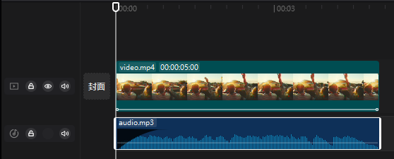
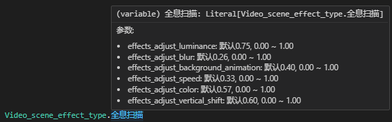

# pyJianYingDraft
### 轻量、灵活、易上手的Python剪映草稿生成及导出工具，构建全自动视频剪辑/混剪流水线！

> 🧪 本项目的**CapCut版本**正在开发中，欢迎关注[CapCut版本仓库](https://github.com/GuanYixuan/pyCapCut)

> 📢 欢迎加入[Discord服务器](https://discord.gg/WfHgGQvhyW)进行用法或新功能的讨论

## 使用思路


# 功能清单
> ℹ 如未额外注明，一般仅在5.9版本上测试过

> 标注☑️的特性**已实现**，标注⬜的特性**待实现**

### 模板模式
> ⚠️ 剪映6+版本对`draft_content.json`文件进行了加密，故**本系列功能目前仅支持剪映5.9及以下版本**

> ℹ 欢迎为本项目补充6+版本草稿文件的解密方式

- ☑️ [加载](#加载模板)（未加密的）`draft_content.json`文件作为模板
- ☑️ [替换音视频片段的素材](#根据名称替换素材)
- ☑️ [修改文本片段的文本内容](#替换文本片段的内容)
- ☑️ [将模板草稿中的音视频/文本轨道整体导入到另一草稿中](#导入模板草稿中的轨道)
- ☑️ [提取模板中出现的贴纸/气泡/花字等元信息](#提取素材元数据)

### 批量导出
> ⚠️ 剪映7+版本隐藏了控件，故**本系列功能目前仅支持剪映6及以下版本**

- ☑️ 控制剪映打开指定草稿
- ☑️ [导出草稿至指定位置](#批量导出草稿)
- ☑️ 调节导出分辨率和帧率

### 视频与图片
> ℹ 以下草稿生成功能（音视频、贴纸、文本、特效等）**支持剪映5及以上的所有版本**

- ☑️ 添加本地视频/图片素材，并[自定义片段的时间、持续时长或播放速度](#素材截取与整体变速)
- ☑️ 视频片段的[音频淡入淡出效果](#音频淡入淡出)
- ☑️ [视频整体调节](#视频整体调节)（旋转、缩放、亮度等）以及[关键帧生成](#关键帧)
- ☑️ 视频片段的[入场/出场/组合动画](#添加片段动画)
- ☑️ 添加[蒙版](#蒙版)、[片段特效](#添加片段特效)和[滤镜](#添加片段滤镜)
- ☑️ （项目700⭐️回馈功能）视频背景填充[(示例代码)](demo.py)
- ☑️ （项目2k⭐️回馈功能）[视频混合模式](#视频混合模式)（正片叠底、滤色、叠加等）
### 贴纸
- ☑️ 根据元信息[添加贴纸](#提取素材元数据)
- ☑️ 贴纸的[关键帧](#关键帧)生成
### 音频
- ☑️ 添加本地音频素材，并[自定义片段的时间、持续时长或播放速度](#素材截取与整体变速)
- ☑️ 调整[淡入淡出](#音频淡入淡出)时长[(示例代码)](demo.py)，调整音量[(示例代码)](demo.py)及其[关键帧](#关键帧)
- ☑️ 添加音频片段的[场景音效果](#添加片段特效)，并设置参数
### 轨道
- ☑️ [添加轨道](#多轨道操作)以及[将片段添加到指定轨道](#多轨道操作)
- ☑️ 自定义视频/滤镜/特效轨道的[层级关系](#多轨道操作)
### 特效、滤镜和转场
- ☑️ 吸附于片段上的[特效](#添加片段特效)、[滤镜](#添加片段滤镜)和[动画](#添加片段动画)
- ☑️ 位于[独立轨道的特效和滤镜](#独立轨道上的特效和滤镜)
- ☑️ 添加转场[(示例代码)](demo.py)，并自定义其时长
### 文本及字幕
- ☑️ [添加文本、设置字体及样式](#添加文本)、修改文本片段的[位置及旋转设置](#视频整体调节)
- ☑️ 文本的[关键帧](#关键帧)以及[动画](#添加片段动画)
- ☑️ 文字描边、背景和阴影
- ☑️ 文字气泡效果和花字效果[(示例代码)](demo.py)
- ☑️ 文本[自动换行](#文本自动换行)，支持设置最大行宽
- ☑️ [导入`.srt`文件](#导入字幕)生成字幕并批量设置格式

# 安装
pyJianYingDraft现已支持pip安装（不含demo），推荐使用开发时测试的Python版本3.8或3.11
```
pip install pyJianYingDraft
```

> ℹ 关于剪映5.9版本的自动升级问题，可参见[相关issue](https://github.com/GuanYixuan/pyJianYingDraft/issues/115)

### 跨平台兼容性
- **Windows**：支持包括草稿生成、模板模式和自动导出在内的所有功能（具体可能受到剪映版本限制）
- **Linux/MacOS**：支持草稿生成和模板模式，但**不支持自动导出**，且注意**生成的草稿仍然需要在Windows版剪映下导出**。

# 快速上手
例程`demo.py`将创建包含音视频素材和一行文本的剪映草稿文件，并且添加了音频淡入、视频入场动画、转场效果和文本气泡/花字。

这个例程的操作方法如下：
1. 找到剪映的**草稿文件夹路径**（类似`.../JianyingPro Drafts`），用其替换代码中的`<你的草稿文件夹>`
2. 运行`demo.py`
3. 在剪映中**找到并打开新创建的`demo`草稿**（可能需要进入再退出某个已有草稿，或重启剪映以刷新草稿列表），你应该看到类似如下的时间轴：



你可以仔细检查音频片段的音量设置、淡入效果时长以及视频片段的入场动画效果等，看看是否符合上述代码的设置

# 用法文档

> ℹ 文档部分推荐从[功能清单](#功能清单)一节中选取感兴趣的功能阅读，而非直接按顺序阅读

### 模板模式
为了保留部分复杂特性（文本特效、复合片段...），可以加载一个已有的剪映草稿作为模板，然后将其中内容导入到另一的草稿中，或直接**替换其中部分片段的内容**。

目前提供了**三种替换功能**：
- [根据名称替换素材](#根据名称替换素材)：直接替换素材本身，自然影响所有引用该素材的片段
- [根据片段替换素材](#根据片段替换素材)：替换某个特定片段的素材，同时重新选取其引用的素材范围
- [替换文本片段的内容](#替换文本片段的内容)：保留所有文本格式，但替换其内容

除此之外，对于某些没有特定名称的特性（贴纸、花字等），提供了[提取素材元数据](#提取素材元数据)的功能以提取其`resource_id`

> ⚠️ 由于剪映6+版本对草稿文件进行了加密，故**暂不支持加载来自6+版本的草稿文件**作为模板

> ℹ 若出现模板内容丢失的情况，欢迎反馈

#### 加载模板
推荐使用`DraftFolder`来管理剪映的草稿文件夹（可以在剪映的`全局设置`-`草稿位置`中查询），这样能够方便地根据已有模板生成新草稿。

```python
import pyJianYingDraft as draft

draft_folder = draft.DraftFolder("<剪映草稿文件夹>")  # 一般形如 ".../JianyingPro Drafts"
script = draft_folder.duplicate_as_template("模板草稿", "新草稿")  # 复制"模板草稿"，并命名为"新草稿"，同时打开新草稿供编辑

# 对返回的ScriptFile对象进行编辑，如替换素材、添加轨道、片段等

script.save()  # 保存你的"新草稿"
```

为了最大限度地兼容模板中的复杂特性，**导入的轨道与pyJianYingDraft创建的轨道是分离开的**，具体地讲：

- 除下述替换功能外，不能在导入的轨道上添加片段、转场、淡入淡出、特效等
- **仍然可以创建新的轨道，并在其上添加片段等**，就像非模板模式一样

> ℹ 导入轨道的限制也许会在后续版本中逐渐取消

#### 提取素材元数据
对导入的`ScriptFile`对象，可以调用`inspect_material`方法提取部分素材的`resource_id`。
`DraftFolder`也有相应的方法来提取指定草稿的素材元数据。

```python
import pyJianYingDraft as draft

draft_folder = draft.DraftFolder("<剪映草稿文件夹>")
draft_folder.inspect_material("草稿名称")

# 或者
script = draft_folder.load_template("草稿名称")
script.inspect_material()
```

上述代码的输出可能类似于

```
贴纸素材:
        Resource id: 7405878923323641129 '秋日手绘-枫叶'
        Resource id: 7429353555447893260 '电商购物促销/哇哦'
        Resource id: 7437707455267671315 '冬日涂鸦winter雪花冬天vlog装饰文字'
        Resource id: 7343931192204463401 '爱心'
文字气泡效果:
        Effect id: 763870 ,Resource id: 6838834573413978631 '标题59'
花字效果:
        Resource id: 7342020000812731658 '彩色手绘线条花字'
```

其中的元数据可用于添加相应素材（例如通过`StickerSegment`的`resource_id`参数）

#### 根据名称替换素材
这种方法将替换素材本身，而不对片段进行直接修改。

> ℹ 由于素材有名称（默认是本地文件的名称），这种替换方式的定位比较方便

> ℹ 由于不涉及时间范围的修改，这种替换方式**尤其适合图像素材**，且几乎不会产生兼容性的问题

以[快速上手](#快速上手)中的草稿为例，假如我们希望换用新的音频素材，可以：
```python
new_material = draft.AudioMaterial("<新的音频素材路径>")
script.replace_material_by_name("audio.mp3", new_material)  # 替换名称为"audio.mp3"的素材
```

替换新素材后，片段所截取的部分仍是素材前5秒，且音量、淡入淡出、播放速度等仍保持不变。

#### 根据片段替换素材
这种方法将替换某个**特定片段**的素材，同时可以**重新选取其引用的素材范围**并**根据新时长在时间轴上伸缩片段**。

> ℹ 由于片段没有名称，故通常需要**依靠片段的下标来定位**

此过程分为两步：**选取轨道**和**替换素材**，以上方音频素材的替换为例：
```python
from pyJianYingDraft import trange, ShrinkMode, ExtendMode

audio_track = script.get_imported_track(
    draft.TrackType.audio,                # 选取导入的音频轨道
    #name="audio",                         # 假如轨道有名称，最好利用名称来定位
    index=0                                # 也可用下标定位, 0表示最底层的同类型轨道
)

script.replace_material_by_seg(
    audio_track, 0, new_material,          # 选取audio_track中下标为0的片段，也即第一个片段
    #source_timerange=None,                # 若不指定，则默认使用整个素材
    source_timerange=trange("0s", "10s"),  # 此处指定截取素材前10秒(注意原片段时长为5秒)
    handle_shrink=ShrinkMode.cut_tail,     # 片段若要缩短，则依靠前移终止点来实现
handle_extend=ExtendMode.push_tail         # 片段若要延长，则依靠后移终止点来实现，必要时允许后移后续片段
)
```

从例子中可见，此替换方法可能会造成片段的时长变化，故可以利用`handle_shrink`和`handle_extend`参数指定片段在缩短和延长时的处理方式。

> ℹ 不显式指定`handle_shrink`和`handle_extend`时，默认的处理方式如下：
> - 新素材比原素材短，则前移片段终止点，使得片段长度与新素材长度一致
> - 新素材比原素材长，则裁剪素材范围，保持片段原长不变

具体的处理方式列表可参见枚举类`ShrinkMode`和`ExtendMode`的定义。

> ℹ 目前已知替换带有组合出入场动画的片段不会自动刷新动画时间

#### 替换文本片段的内容
这种方法将替换某个**特定文本片段**的内容，但保留其所有格式。

此过程同样分为**选取轨道**和**替换内容**两个步骤：其中“选取轨道”可参考[根据片段替换素材](#根据片段替换素材)中的示例。

以下假定我们已经选取了合适的文本轨道`text_track`，则只需：
```python
script.replace_text(
    text_track, 0,  # 选取text_track中下标为0的片段，也即第一个片段
    "新文本内容"     # 新的文本内容
)
```

#### 导入模板草稿中的轨道

此功能会字面意义地复制模板草稿中的指定轨道到新草稿中, 适合用于拼接多个模板草稿。

> ℹ **目前仅支持导入音视频/文本轨道**, 支持的范围将来会继续扩展

> ⚠️ 本方法会保留各片段及其素材的id, 因而**不支持向同一草稿多次导入同一轨道**

例如
```python
source_script = draft_folder.load_template("<模板草稿名称>")     # 加载模板草稿
target_script = draft_folder.create_draft("新草稿", 1920, 1080)  # 创建新草稿

# 选取模板中的一个文本轨道
text_track = source_script.get_imported_track(
    draft.TrackType.text,                # 选取导入的文本轨道
    #name="text",                        # 假如轨道有名称，最好利用名称来定位
    index=0                              # 也可用下标定位, 0表示最底层的同类型轨道
)

# 导入文本轨道到新草稿
target_script.import_track(
    source_script, text_track,
    offset=target_script.duration,  # 导入的轨道将放在新草稿末尾
    new_name="imported_text",       # 可选的新轨道名
    relative_index=1,               # 相对于所有文本轨道的位置, 值越大越接近前景, 可以是负数
)
```

### 批量导出草稿
作为整个自动化流程中的最后一步，本项目提供了基础的草稿批量导出功能。

> ⚠️ 剪映7+版本对控件进行了隐藏，故本功能目前**仅支持剪映6及以下版本**

> ⚠️ 本部分功能依赖于`uiautomation`库，故目前**仅支持在Windows系统下运行**

> ℹ 导出程序会将剪映窗口置顶，且需要控制光标进行点击，**建议在闲时/夜间运行**

> ℹ 本部分功能**在剪映专业版5.9和6.8中测试通过**

> ℹ 有用户反映部分Python版本(如3.13)下`uiautomation`会出现依赖问题, 推荐使用3.8、3.10或3.11, [详见此处](https://github.com/GuanYixuan/pyJianYingDraft/issues/12)

> ⚠️ 请**确认有导出草稿的相关权限(不使用VIP功能或已开通VIP)**, 否则可能陷入死循环

导出利用`JianyingController`类进行，具体用法如下：

```python
import pyJianYingDraft as draft
from pyJianYingDraft import ExportResolution, ExportFramerate

# 此前需要将剪映打开，并位于目录页
ctrl = draft.JianyingController()

# 然后即可导出指定名称的草稿, 注意导出结束后视频才会被剪切(重命名)至指定位置
ctrl.export_draft("要导出的草稿名称", "<导出路径>")  # "导出路径"可以指向文件夹或直接指向文件

# 若希望调节分辨率或帧率, 可使用`resolution`和`framerate`参数
ctrl.export_draft("要导出的草稿名称", "<导出路径>",
                  resolution=ExportResolution.RES_1080P,
framerate=ExportFramerate.FR_24)
```

重复上述单次导出操作即可实现批量导出，类似如下代码：
```python
draft_names = ...
export_folder = ...
for name in draft_names:
    ctrl.export_draft(name, os.path.join(export_folder, name, ".mp4"))
```

### 时间与轨道

#### 时间格式
**剪映（和本项目）内部均采用微秒为单位保存时间**，但这不便于输入，故我们增加了一种“字符串形式”的时间，大部分时间参数均同时支持这两种形式：
- 微秒形式：用`int`表达，适于计算
- 字符串形式：用`str`表达，如`"1.5s"`、`"1h3m12s"`等，易于输入

如果你希望显式地将字符串形式转换为微秒形式，可以使用`tim`函数；`trange`函数则是支持字符串形式输入的`Timerange`便捷构造函数。

> ⚠️ 注意`trange`的第二个参数是**持续时长**，而不是结束时间

例如：
```python
import pyJianYingDraft as draft
from pyJianYingDraft import SEC, tim, trange

# 1秒钟
assert 1000000 == SEC == tim("1s") == tim("0.01666667m")

# 0~1分钟
assert draft.Timerange(0, 60*SEC) == trange("0s", "1m") == trange("0s", "0.5m30s")

# 片段开始后2秒
seg: draft.VideoSegment
assert seg.target_timerange.start + 2*SEC == seg.target_timerange.start + tim("2s")
```

#### 素材截取与整体变速
截取和变速均在`Segment`创建时设置完成，具体是通过`target_timerange`、`source_timerange`和`speed`参数来共同实现的。
> ℹ 目前暂不支持设置曲线变速

以下以`VideoSegment`为例，`AudioSegment`的用法相同，此二者支持两种构造方式：
1. **便捷构造**：直接传入素材路径字符串，自动构造素材实例
2. **传统构造**：先创建素材实例，再传入片段构造函数。**若需要设置素材的图像裁剪属性请使用此方式**

```python
import os
import pyJianYingDraft as draft
from pyJianYingDraft import trange, SEC

# 假定已有草稿文件script（参见“快速上手”），创建三个轨道
for i in range(3, 0, -1): # 倒序
    script.add_track(draft.TrackType.video, "%d" % i)

# 以下部分讲解素材与片段的创建
# 方式一：便捷构造（推荐）
tutorial_asset_dir = os.path.join(os.path.dirname(__file__), 'readme_assets', 'tutorial')
video_path = os.path.join(tutorial_asset_dir, 'video.mp4')

# 直接传入素材路径
seg1 = draft.VideoSegment(video_path, trange("0s", "4s"))  # 截取素材的前4秒

# 方式二：传统构造
mat = draft.VideoMaterial(video_path)  # 先创建素材实例
seg2 = draft.VideoSegment(mat, trange("0s", "4s"))  # 再传入片段构造函数

# 视频素材长度为 5s
print("Video material length: %f s" % (mat.duration / SEC))

# 以下部分讲解素材的时间截取与变速
# 不指定source_timerange，则自动从头截取素材等长片段
seg11 = draft.VideoSegment(video_path, trange("0s", "4s"))              # 自动截取素材的前4秒（4s表示持续时长）
seg2  = draft.VideoSegment(video_path, trange("0s", "4s"), speed=1.25)  # 自动截取素材的前4*1.25=5秒
seg4  = draft.VideoSegment(video_path, trange("0s", "3s"), speed=3.0)   # 截取前3*3.0=9秒，素材不够长故报错

# 指定source_timerange，则截取素材的指定片段，自动设置速度
seg12 = draft.VideoSegment(video_path, trange("4s", "1s"),
                            source_timerange=trange(0, "4s"))     # 将素材在1s内放完，速度自动设置为5.0

# 同时指定source_timerange和speed，则截取素材的指定片段，并根据播放速度覆盖target_timerange的duration
seg3  = draft.VideoSegment(video_path, trange("1s", "66666h"),
                            source_timerange=trange(0, "5s"),
                            speed=2.0) # 将长5s的素材按2倍速放完，target_timerange的duration自动设为2.5s

# 将片段加入轨道
script.add_segment(seg11, "1").add_segment(seg12, "1")
script.add_segment(seg2, "2")
script.add_segment(seg3, "3")

# 保存草稿
script.dump("*你的草稿工程文件夹*/draft_content.json")
```

#### 多轨道操作
目前`ScriptFile.add_track`方法已支持创建多个同类型轨道，并支持自定义其顺序：
```python
script.add_track(draft.TrackType.video,
                 track_name="前景",       # 轨道名
                 relative_index=2)        # 在所有视频轨道中的相对位置
script.add_track(draft.TrackType.video,
                 track_name="背景",
                 relative_index=1)        # 由于1<2，所以前景轨道位于更上方
```

> ℹ 对于相同index的轨道，默认**后创建的轨道位于上方**

一旦创建了多个同类轨道，则在添加片段时必须指定目标轨道，例如：
```python
script.add_segment(video_segment, "背景")
```

### 视频整体调节
每个视频片段都可以单独设置裁剪、旋转、翻转、缩放、透明度、亮度等属性，这些设置通过`VideoSegment`构造函数中的`clip_settings`参数传入
> ℹ 关键帧的优先级高于整体调节，故前者会覆盖后者的相应设置

下方的例子将创建一个视频片段，并设置其不透明度为0.5、打开水平翻转：
```python
from pyJianYingDraft import ClipSettings
video_segment = draft.VideoSegment(video_material,
                                   draft.Timerange(0, video_material.duration),      # 与素材等长
                                   clip_settings=ClipSettings(alpha=0.5,             # 不透明度为0.5
                                                              flip_horizontal=True)  # 打开水平翻转
                                    )
```

更具体的参数说明可参见`ClipSettings`的构造函数。

### 关键帧
关键帧是吸附在**片段**上的“时刻-数值”对，所以创建关键帧只需要在`add_keyframe`方法中指定**相对片段头部的**时刻、数值以及控制的属性即可。
> ℹ 目前不支持设置特效或滤镜参数的关键帧

下方的例子尝试使用两个不透明度关键帧模拟视频的淡出效果：
```python
import os
import pyJianYingDraft as draft
from pyJianYingDraft import KeyframeProperty, SEC

# 假定已有草稿文件script（参见“快速上手”），创建视频轨道
script.add_track(draft.TrackType.video)
tutorial_asset_dir = os.path.join(os.path.dirname(__file__), 'readme_assets', 'tutorial')

# 创建视频片段
video_material = draft.VideoMaterial(os.path.join(tutorial_asset_dir, 'video.mp4'))
video_segment = draft.VideoSegment(video_material,
                                   draft.Timerange(0, video_material.duration)) # 与素材等长

# 添加两个不透明度关键帧形成1s的淡出效果
video_segment.add_keyframe(KeyframeProperty.alpha, video_segment.duration - SEC, 1.0) # 结束前1s完全不透明
video_segment.add_keyframe(KeyframeProperty.alpha, video_segment.duration, 0.0) # 片段结束时完全透明

# 添加片段到轨道
script.add_segment(video_segment)

# 保存草稿
script.dump("*你的草稿工程文件夹*/draft_content.json")
```

除了`alpha`外，`KeyframeProperty`中还有平移、旋转、缩放、音量、饱和度等属性，它们都可以设置关键帧。
文本和贴纸片段的关键帧也可以用相同方法进行设置，但注意它们只支持位置和大小相关的那些属性。

对音频片段，目前只能设置音量的关键帧，此时你不需要指定`KeyframeProperty`
```python
audio_segment: draft.AudioSegment
audio_segment.add_keyframe("0s", 0.6) # 片段开始时的音量为60%
```

### 音频淡入淡出
音频淡入淡出效果可以为音频片段和带音轨的视频片段添加平滑的音量过渡。使用`add_fade()`方法即可实现：

```python
import pyJianYingDraft as draft
from pyJianYingDraft import trange

# 为音频片段添加淡入淡出
audio_segment = draft.AudioSegment("audio.mp3", trange("0s", "10s"))
audio_segment.add_fade("1s", "2s")  # 1秒淡入，2秒淡出

# 为带音轨的视频片段添加淡入淡出
video_segment = draft.VideoSegment("video_with_audio.mp4", trange("0s", "10s"))
video_segment.add_fade("1.5s", "1.5s")  # 1.5秒淡入，1.5秒淡出
```

其中：
- `add_fade()`方法接受两个参数：淡入时长和淡出时长
- 对于视频片段，淡入淡出效果仅对有音轨的视频有效
- 每个片段只能添加一次淡入淡出效果，重复调用会抛出`ValueError`

### 蒙版
蒙版的添加非常简单：调用`VideoSegment`的`add_mask`方法即可：
```python
from pyJianYingDraft import MaskType

# 添加一个线性蒙版，中心点在素材的(100, 0)像素处，顺时针旋转45度
video_segment1.add_mask(MaskType.线性, center_x=100, rotation=45)
# 添加一个圆形蒙版，直径占素材的50%
video_segment2.add_mask(MaskType.圆形, size=0.5)
```
其中：
- `MaskType`保存了剪映自带的蒙版类型
- `center_x`和`center_y`参数表示蒙版中心点的坐标，与剪映中意义一致
- `rotation`、`feather`、`round_corner`分别表示旋转、羽化、圆角参数，与剪映中意义一致
- `size`参数表示蒙版的”主要尺寸”（镜面的可视部分高度/圆形直径/爱心高度等）占素材的比例

更具体的参数说明请参见`add_mask`方法的注释。

### 视频混合模式
混合模式用于控制视频片段与下层内容的混合方式，实现正片叠底、滤色、叠加等效果。

> ℹ 混合模式需要至少两个视频轨道：一个基础轨道和一个叠加轨道

> ℹ 叠加轨道必须位于基础轨道上方，可通过`relative_index`参数控制层次

使用`VideoSegment.set_mix_mode()`方法为视频片段设置混合模式：
```python
from pyJianYingDraft import MixModeType

# 创建两个视频轨道，明确层次关系
script.add_track(draft.TrackType.video, "base", relative_index=1)      # 基础轨道在下层
script.add_track(draft.TrackType.video, "overlay", relative_index=2)   # 叠加轨道在上层

# 基础视频片段
base_video = draft.VideoSegment("base.mp4", trange("0s", "10s"))
script.add_segment(base_video, track_name="base")

# 叠加视频片段，使用”滤色”混合模式
overlay_video = draft.VideoSegment("overlay.mp4", trange("0s", "10s"))
overlay_video.set_mix_mode(MixModeType.滤色)
script.add_segment(overlay_video, track_name="overlay")
```

`MixModeType`支持以下10种混合模式：
- `正片叠底`、`颜色减淡`、`颜色加深`、`线性加深`
- `柔光`、`强光`、`滤色`、`叠加`
- `变亮`、`变暗`

### 特效、动画和滤镜
#### 特效类型
目前支持的**特效**类型由以下枚举类定义：
- 音频：`AudioSceneEffectType`（场景音）
- 视频：`VideoSceneEffectType`（画面特效）、`VideoCharacterEffectType`（人物特效）

目前支持的**动画**类型由以下枚举类定义：
- 视频：`IntroType`（入场）, `OutroType`（出场）, `GroupAnimationType`（组合动画）
- 文本：`TextIntro`（入场）、`TextOutro`（出场）, `TextLoopAnim`（循环动画）

**滤镜**类型则保存在`FilterType`中，仅对视频片段有效。

上述枚举类中的成员（通常）直接**以特效或滤镜的名字命名**，并注释了相应参数，例如：



你也可以使用`from_name`方法来获取特定的成员，其忽略大小写、空格和下划线，例如：

```python
assert VideoSceneEffectType.from_name("__全息 扫描__") == VideoSceneEffectType.全息扫描
```

#### 添加片段特效
添加特效使用的方法是`segment.add_effect()`，它接受特效类型和一个参数数组，参数数组的顺序**与特效类型注释中的参数顺序一致**，但**不一定与剪映内的参数顺序一致**。

下方的例子为视频片段添加一个`全息扫描`特效，并且指定其`氛围`参数为（剪映中的）100，其余参数默认：
```python
from pyJianYingDraft import VideoSceneEffectType

video_segment.add_effect(VideoSceneEffectType.全息扫描,
                         [None, None, 100.0]) # 不设置前两个参数, 第三个参数（氛围）为100，其余参数也不设置
```
音频片段的特效添加方法与视频片段相似

#### 添加片段滤镜
滤镜的添加方法与特效类似，其使用的是`VideoSegment.add_filter()`方法。
与特效不同的是，滤镜只支持一个“滤镜强度”参数，且仅当所选滤镜能够调节强度时有效。

```python
from pyJianYingDraft import FilterType

video_segment1.add_filter(FilterType.原生肤, 10)  # 设置"原生肤"强度为10
video_segment2.add_filter(FilterType.冰雪世界, 50)  # 设置"冰雪世界"强度为50
```

#### 独立轨道上的特效和滤镜
除了为视频片段添加特效和滤镜外，你还可以创建独立的特效轨道和滤镜轨道，并在其上添加特效和滤镜片段。

首先使用`ScriptFile.add_track()`方法创建特效轨道或滤镜轨道。若需要指定顺序请参考[多轨道操作](#多轨道操作)
```python
script.add_track(draft.TrackType.effect, "my_effect")  # 创建名为"my_effect"的特效轨道
script.add_track(draft.TrackType.filter, "my_filter")  # 创建名为"my_filter"的滤镜轨道
```

接下来便可使用`add_effect`和`add_filter`方法向这些轨道添加片段：
```python
from pyJianYingDraft import VideoSceneEffectType, FilterType, trange

# 在特效轨道上添加一个"胶片闪切"特效，持续5秒，并设置其参数
script.add_effect(VideoSceneEffectType.胶片闪切, trange("0s", "5s"),
                  track_name="my_effect",  # 当特效轨道只有一条时可省略
                  params=[50, None, 80])  # 设置速度为50，保持强度默认(100)，设置纹理为80

# 在滤镜轨道上添加一个"哈苏蓝"滤镜，持续整个视频，强度为70
script.add_filter(FilterType.哈苏蓝, trange(0, script.duration),
                  track_name="my_filter",  # 当滤镜轨道只有一条时可省略
                  intensity=70)
```

#### 添加片段动画
添加动画使用的方法是`segment.add_animation()`，其仅接收一个动画类型作为参数，动画的持续时间由其默认值决定。若需要添加多个动画，可对同一个片段调用多次该方法。

> ℹ 为**文本片段**同时设置循环动画和入出场动画时, 请**先添加出入场动画再添加循环动画**

以下是为一个文本片段添加三种动画的例子：
```python
from pyJianYingDraft import TextIntro, TextOutro, TextLoopAnim

text_seg.add_animation(TextIntro.复古打字机).add_animation(TextOutro.弹簧)
text_seg.add_animation(TextLoopAnim.色差故障)  # 注意：循环动画必须在出入场动画之后添加
```

### 文本及字幕
#### 添加文本
添加文本与添加视频/音频片段类似，只需创建`TextSegment`对象并利用`add_segment`添加到`ScriptFile`中即可。
其**字体**、**文字样式**及**图像调节**设置可分别通过`font`, `style`和`clip_settings`参数设置。

例如：
```python
import pyJianYingDraft as draft
from pyJianYingDraft import FontType, TextStyle, ClipSettings

# 带下划线、位置及大小类似字幕的浅蓝色文本
seg1 = draft.TextSegment("Subtitle", trange("0s", "10s"),
                          font=FontType.文轩体,
                          style=TextStyle(size=5.0, color=(0.7, 0.7, 1.0), underline=True, align=1),
                          clip_settings=ClipSettings(transform_y=-0.8))
```

更具体的参数说明可参见`TextStyle`和`ClipSettings`的构造函数。

#### 文本自动换行
文本片段支持自动换行功能，可以通过`TextStyle`的`auto_wrapping`和`max_line_width`参数来控制：

```python
# 启用自动换行，设置最大行宽为屏幕宽度的70%
seg2 = draft.TextSegment("这是一段很长的文本内容，当超过设定的最大行宽时会自动换行显示",
                          trange("0s", "10s"),
                          font=FontType.文轩体,
                          style=TextStyle(size=5.0,
                                          auto_wrapping=True,      # 启用自动换行
                                          max_line_width=0.7))     # 最大行宽占屏幕70%
```

#### 导入字幕
> ℹ 目前只支持导入**SRT格式**的字幕文件

导入字幕本质上是根据每条字幕的时间戳及内容创建一系列文本，并添加到轨道中。这一过程通过`ScriptFile.import_srt`来实现。
导入的字幕默认启用自动换行功能。

例如：
```python
import pyJianYingDraft as draft

# 假定已有草稿文件script（参见“快速上手”）

# 将字幕导入到名为"subtitle"的轨道中，若轨道不存在将自动创建
# 不指定style和clip_settings，则默认模拟剪映导入字幕时的样式
script.import_srt("subtitle.srt", track_name="subtitle", time_offset="1.5s")  # 字幕整体后移1.5秒

# 可以利用`text_style`和`clip_settings`参数对字幕的样式进行调整, 上述参数的意义与`TextSegment()`中的相同
script.import_srt("subtitle.srt", track_name="subtitle",
                  text_style=draft.TextStyle(size=10.0, color=(1.0, 0.0, 0.0))
                  clip_settings=draft.ClipSettings(transform_y=0.8))  # 将字幕放置在屏幕上方

# 如果需要更复杂的样式或希望为字幕应用动画，可以为`style_reference`参数传入一个`TextSegment`对象作为样式参考（忽略其文本和片段长度设置）
# 注意动画时间不会根据字幕片段长度进行调节，故当字幕片段过短时可能出现奇怪的效果
script.import_srt("subtitle.srt", track_name="subtitle", style_reference=seg1)  # 以上一节“添加文本”中的文本作为参考

# 默认不会采用`style_reference`片段中的`clip_settings`设置，如果需要的话请显式传入`clip_settings=None`
script.import_srt("subtitle.srt", track_name="subtitle", style_reference=seg1, clip_settings=None)  # 相当于clip_settings=seg1.clip_settings
```
