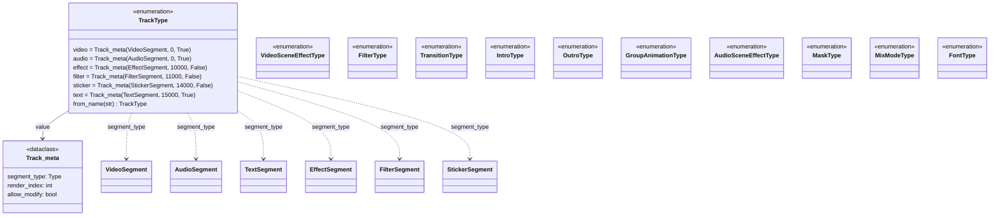
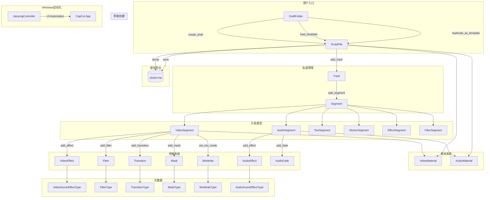

# pyJianYingDraft 架构图

## 类层次结构图

```mermaid
classDiagram
    direction TB

    class ScriptFile {
        +int width
        +int height
        +int fps
        +int duration
        +ScriptMaterial materials
        +Dict~str, Track~ tracks
        +add_track()
        +add_segment()
        +add_material()
        +save() / dump()
        +import_srt()
        +load_template()
    }

    class ScriptMaterial {
        +List~VideoMaterial~ videos
        +List~AudioMaterial~ audios
        +List~VideoEffect~ video_effects
        +List~Filter~ filters
        +List~Transition~ transitions
        +List~AudioFade~ audio_fades
        +List~Mask~ masks
        +List~MixMode~ mix_modes
        +List~BackgroundFilling~ canvases
    }

    class Track {
        +TrackType track_type
        +str name
        +str track_id
        +int render_index
        +List~BaseSegment~ segments
        +add_segment()
        +export_json()
    }

    class BaseSegment {
        +str segment_id
        +str material_id
        +Timerange target_timerange
        +List~KeyframeList~ common_keyframes
        +add_keyframe()
        +overlaps()
        +export_json()
    }

    class MediaSegment {
        +Optional~Timerange~ source_timerange
        +Speed speed
        +float volume
        +bool change_pitch
    }

    class VisualSegment {
        +ClipSettings clip_settings
        +bool uniform_scale
        +Optional~SegmentAnimations~ animations_instance
        +add_animation()
    }

    class VideoSegment {
        +VideoMaterial material_instance
        +Tuple~int,int~ material_size
        +List~VideoEffect~ effects
        +List~Filter~ filters
        +List~MixMode~ mix_modes
        +Optional~Mask~ mask
        +Optional~Transition~ transition
        +Optional~BackgroundFilling~ background_filling
        +Optional~AudioFade~ fade
        +add_effect()
        +add_filter()
        +add_mask()
        +add_transition()
        +set_mix_mode()
        +add_background_filling()
        +add_fade()
    }

    class AudioSegment {
        +AudioMaterial material_instance
        +Optional~AudioFade~ fade
        +List~AudioEffect~ effects
        +add_effect()
        +add_fade()
    }

    class TextSegment {
        +str text
        +Optional~EffectMeta~ font
        +TextStyle style
        +Optional~TextBorder~ border
        +Optional~TextBackground~ background
        +Optional~TextShadow~ shadow
        +Optional~TextBubble~ bubble
        +Optional~TextEffect~ effect
        +add_animation()
        +add_bubble()
        +add_effect()
    }

    class StickerSegment {
        +str resource_id
        +export_material()
    }

    class EffectSegment {
        +VideoEffect effect_inst
    }

    class FilterSegment {
        +Filter material
    }

    class VideoMaterial {
        +str material_id
        +str material_name
        +str path
        +int duration
        +int width
        +int height
        +CropSettings crop_settings
        +export_json()
    }

    class AudioMaterial {
        +str material_id
        +str material_name
        +str path
        +int duration
        +export_json()
    }

    class CropSettings {
        +float upper_left_x/y
        +float upper_right_x/y
        +float lower_left_x/y
        +float lower_right_x/y
    }

    class ClipSettings {
        +float alpha
        +float rotation
        +float scale_x/scale_y
        +float transform_x/transform_y
        +bool flip_horizontal/vertical
    }

    class VideoEffect {
        +str global_id
        +str effect_id
        +str resource_id
        +List~EffectParamInstance~ adjust_params
    }

    class Filter {
        +str global_id
        +EffectMeta effect_meta
        +float intensity
    }

    class Transition {
        +str global_id
        +str effect_id
        +str resource_id
        +int duration
        +bool is_overlap
    }

    class Mask {
        +str global_id
        +MaskMeta mask_meta
        +float center_x/y
        +float width/height
        +float rotation/feather
    }

    class MixMode {
        +str global_id
        +EffectMeta effect_meta
    }

    class BackgroundFilling {
        +str global_id
        +str fill_type
        +float blur
        +str color
    }

    class AudioFade {
        +str fade_id
        +int in_duration
        +int out_duration
    }

    class AudioEffect {
        +str effect_id
        +str resource_id
        +str category_id
        +List~EffectParamInstance~ audio_adjust_params
    }

    class SegmentAnimations {
        +str animation_id
        +List~VideoAnimation~ animations
        +add_animation()
    }

    class Timerange {
        +int start
        +int duration
        +int end
        +overlaps()
    }

    class KeyframeList {
        +KeyframeProperty keyframe_property
        +List~Keyframe~ keyframes
        +add_keyframe()
    }

    class DraftFolder {
        +str folder_path
        +list_drafts()
        +create_draft()
        +load_template()
        +duplicate_as_template()
        +inspect_material()
    }

    %% 继承关系
    BaseSegment <|-- MediaSegment
    BaseSegment <|-- EffectSegment
    BaseSegment <|-- FilterSegment
    MediaSegment <|-- AudioSegment
    MediaSegment <|-- VisualSegment
    VisualSegment <|-- VideoSegment
    VisualSegment <|-- StickerSegment
    VisualSegment <|-- TextSegment

    %% 关联关系
    ScriptFile --> ScriptMaterial : contains
    ScriptFile --> Track : contains
    ScriptFile --> DraftFolder : manages
    Track o-- BaseSegment : contains
    ScriptMaterial --> VideoMaterial : contains
    ScriptMaterial --> AudioMaterial : contains
    ScriptMaterial --> VideoEffect : contains
    ScriptMaterial --> Filter : contains
    ScriptMaterial --> Transition : contains
    ScriptMaterial --> AudioFade : contains
    ScriptMaterial --> Mask : contains
    ScriptMaterial --> MixMode : contains
    ScriptMaterial --> BackgroundFilling : contains
    VideoSegment --> VideoMaterial : uses
    AudioSegment --> AudioMaterial : uses
    VideoSegment --> ClipSettings : has
    VideoSegment --> Mask : has
    VideoSegment --> VideoEffect : has
    VideoSegment --> Filter : has
    VideoSegment --> Transition : has
    VideoSegment --> MixMode : has
    VideoSegment --> BackgroundFilling : has
    VideoSegment --> AudioFade : has
    AudioSegment --> AudioFade : has
    TextSegment --> TextStyle : has
    TextSegment --> TextBubble : has
    TextSegment --> TextEffect : has
    TextSegment --> ClipSettings : has
    VideoSegment --> SegmentAnimations : has
    BaseSegment --> Timerange : has
    BaseSegment --> KeyframeList : has
    VideoSegment --> CropSettings : has
```

## 轨道类型与元数据枚举

```mermaid
classDiagram
    direction TB

    class TrackType {
        <<enumeration>>
        video = Track_meta(VideoSegment, 0, True)
        audio = Track_meta(AudioSegment, 0, True)
        effect = Track_meta(EffectSegment, 10000, False)
        filter = Track_meta(FilterSegment, 11000, False)
        sticker = Track_meta(StickerSegment, 14000, False)
        text = Track_meta(TextSegment, 15000, True)
        from_name(str) TrackType
    }

    class Track_meta {
        <<dataclass>>
        segment_type: Type
        render_index: int
        allow_modify: bool
    }

    %% 元数据枚举
    class VideoSceneEffectType {
        <<enumeration>>
    }
    class FilterType {
        <<enumeration>>
    }
    class TransitionType {
        <<enumeration>>
    }
    class IntroType {
        <<enumeration>>
    }
    class OutroType {
        <<enumeration>>
    }
    class GroupAnimationType {
        <<enumeration>>
    }
    class AudioSceneEffectType {
        <<enumeration>>
    }
    class MaskType {
        <<enumeration>>
    }
    class MixModeType {
        <<enumeration>>
    }
    class FontType {
        <<enumeration>>
    }

    TrackType --> Track_meta : value
    TrackType ..> VideoSegment : segment_type
    TrackType ..> AudioSegment : segment_type
    TrackType ..> TextSegment : segment_type
    TrackType ..> EffectSegment : segment_type
    TrackType ..> FilterSegment : segment_type
    TrackType ..> StickerSegment : segment_type
```

## 数据流与模块关系

```mermaid
flowchart TB
    subgraph 用户入口
        DF[DraftFolder]
        SF[ScriptFile]
    end

    subgraph 草稿创建
        DF -->|create_draft| SF
        DF -->|load_template| SF
        DF -->|duplicate_as_template| SF
    end

    subgraph 轨道管理
        SF -->|add_track| TR[Track]
        TR -->|add_segment| SEG[Segment]
    end

    subgraph 片段类型
        SEG --> VSEG[VideoSegment]
        SEG --> ASEG[AudioSegment]
        SEG --> TSEG[TextSegment]
        SEG --> SSEG[StickerSegment]
        SEG --> ESEG[EffectSegment]
        SEG --> FSEG[FilterSegment]
    end

    subgraph 素材系统
        VSEG --> VMAT[VideoMaterial]
        ASEG --> AMAT[AudioMaterial]
        SF --> VMAT
        SF --> AMAT
    end

    subgraph 特效系统
        VSEG -->|add_effect| VEFF[VideoEffect]
        VSEG -->|add_filter| FILTER[Filter]
        VSEG -->|add_mask| MASK[Mask]
        VSEG -->|add_transition| TRANS[Transition]
        VSEG -->|set_mix_mode| MIX[MixMode]
        ASEG -->|add_effect| AEFF[AudioEffect]
        ASEG -->|add_fade| FADE[AudioFade]
    end

    subgraph 元数据
        VEFF --> VSET[VideoSceneEffectType]
        FILTER --> FT[FilterType]
        TRANS --> TT[TransitionType]
        MASK --> MT[MaskType]
        MIX --> MMT[MixModeType]
        AEFF --> ASET[AudioSceneEffectType]
    end

    subgraph 保存导出
        SF -->|dump| JSON[(JSON File)]
        SF -->|save| JSON
    end

    subgraph Windows自动化
        JC[JianyingController]
        JC -->|UI Automation| CAPCUT[CapCut App]
    end
```
